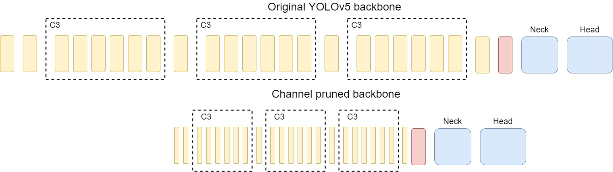
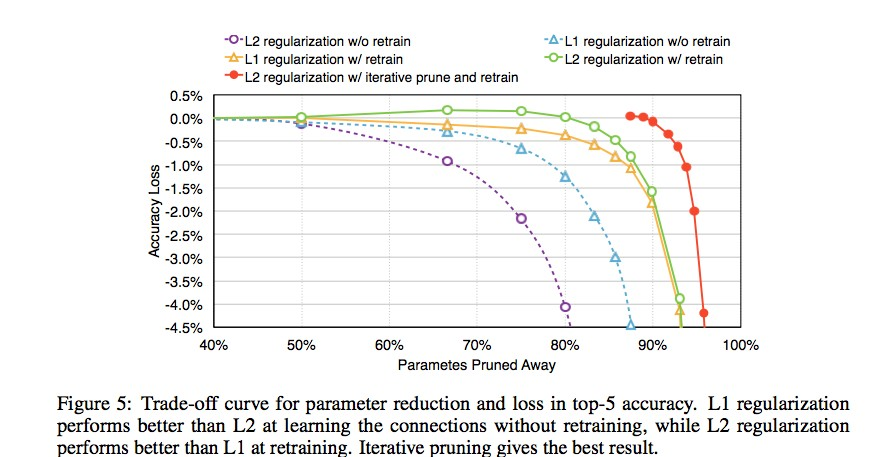

# Channel Pruning 

## What's Channel Pruning

### Goal 
Aim to reduce the channel numbers in the network while minimizing the reconstruction error (accuracy loss)
To rank the importance of channels, we have to choose a ranking algorithm (L1, L2, FPGM, etc.)



### Ranking algorithm 
To rank the importance of every channel (ex: L1, L2, APOz, FPGM, etc.) <br>
Example of channel pruning, for more details, please refer to [NNI](https://nni.readthedocs.io/en/stable/tutorials/pruning_quick_start_mnist.html)
```python 
from nni.compression.pytorch.pruning import L1NormPruner
pruner = L1NormPruner(model, config_list)
# compress the model and generate the masks
_, masks = pruner.compress()
```

### Pruning Scheduler 
Experiment results shows that pruning from low sparsity to high sparsity, iteratively increase sparsity with finetuning can significantly reduce accuracy loss 


### Why Channel Pruning

### Pros and Cons 
Pros:
- Pruning can significantly decrease inference time in general 
- Most pruning time acceptable in general (depends on pruning methods)

Cons: 
- Accuracy loss may be huge 

## Tutorials
[Iterative pruning on yolov5](./iterative_pruning.md) <br><br>
[Pruning on yolov5 backbone](./prune.md) 